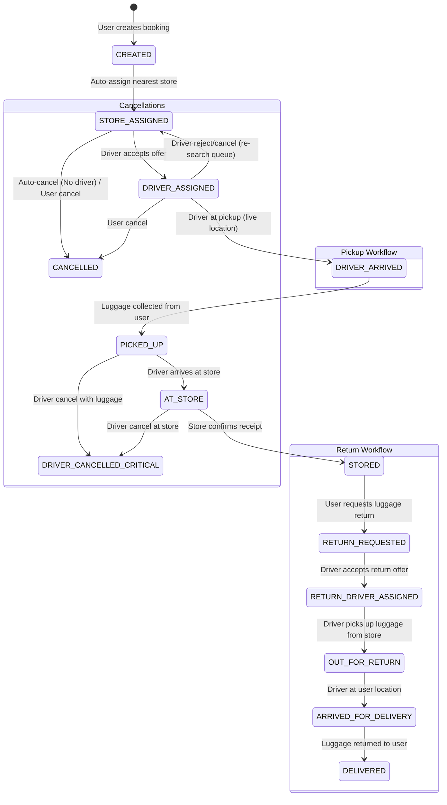

# HoldIT: Schedule Booking & Logistics Workflow System

This document outlines the complete lifecycle of a booking request, mapping out state transitions, driver assignments, real-time WebSocket events, and error handling behaviors across the HoldIT platform.

---

## 1. Booking State Machine

---

## 2. API Endpoints Lifecycle Mapping

### User Endpoints (`/api/v1/user/booking`)
| Status Trigger | Endpoint | Description |
|---|---|---|
| `CREATED` | `POST /schedule-pickup` | Validates luggage, charges card, searches for store and dispatch driver job. |
| `RETURN_REQUESTED` | `POST /:booking_id/request-return` | Triggers BullMQ job to lock return driver. |
| `CANCELLED` | `POST /:booking_id/cancel` | Allowed only in sub-terminal pickup states. Auto-refunds if paid. |

### Driver Endpoints (`/api/v1/driver/rides`)
| Status Trigger | Endpoint | Description |
|---|---|---|
| `DRIVER_ASSIGNED` / `RETURN_DRIVER_ASSIGNED` | `POST /:booking_id/accept` | Accepts pending offer. Marks driver `is_on_trip = true`. |
| `DRIVER_ARRIVED` | `PUT /:booking_id/arrive-pickup` | Reached customer location. |
| `PICKED_UP` | `PUT /:booking_id/complete-pickup` | Luggage securely transferred. |
| `AT_STORE` | `PUT /:booking_id/arrive-store` | Arrived at Dropoff Store location. |
| `DELIVERED` | `PUT /:booking_id/complete-delivery` | Dropped off luggage back to user. Marks driver available. |
| `CANCELLED` (or re-queue) | `POST /:booking_id/cancel` | Resets assignment. Re-queues if safe, flags Ops if critical. |

### Store Endpoints (`/api/v1/store/booking`)
| Status Trigger | Endpoint | Description |
|---|---|---|
| `STORED` | `POST /:booking_id/confirm-stored` | Store verifies physical luggage dropoff. Modifies store capacity. |
| N/A | `POST /:booking_id/verify-return-otp` | Store confirms driver pickup via OTP before driver leaves for `OUT_FOR_RETURN`. |

---

## 3. Real-Time Tracking (Socket.io)

WebSockets are implemented via Redis Adapter for horizontal scale. The socket layer only emits state updates; business logic goes strictly through HTTP REST APIs.

### Key Event Emitters
- `BOOKING_STORE_ASSIGNED`: Sent to User and Target Store.
- `BOOKING_DRIVER_SEARCHING`: Sent to User.
- `BOOKING_DRIVER_ASSIGNED`: Sent to User. Payload contains Live Location array.
- `BOOKING_DRIVER_ARRIVED`: Sent to User.
- `BOOKING_PICKED_UP`: Sent to User & Store.
- `BOOKING_ARRIVED_AT_STORE`: Sent to Store.
- `BOOKING_STORED`: Sent to User & Admin.
- `DRIVER_LOCATION_UPDATED`: Streaming (2s interval) live tracker for `DRIVER_ASSIGNED` through `DELIVERED`.

### Connect & Room Logic
Users securely request continuous pings by emitting:
`socket.emit('USER_SUBSCRIBE_BOOKING', { bookingId })`

Which joins them to the temporary Redis broadcasting room: `driver:location:{bookingId}`. Drivers publish to this room exclusively via `DRIVER_LOCATION_UPDATE`.

---

## 4. Job Queues & Redis

BullMQ handles fault-tolerant search scaling:
1. `DRIVER_ASSIGN_QUEUE`: 
    - Job `DRIVER_SEARCH`: Filters Redis `GeoRadius` index, checks driver workload, drops offer config in cache. Use `createDriverAssignWorker`.
2. `BOOKING_AUTO_CANCEL`:
    - Job ignores manual operations. After 10 mins without acceptance, calls `autoCancelBooking` and processes reverse transaction refunds.
3. `RETURN_PROCESS`:
    - Job `PROCESS_RETURN`: Reads state, queues the `RETURN` driver search job. 

### Critical Caches (`redis`)
- `driver:location:{driver_id}`: Real-time telemetry (5m TTL).
- `booking:offer:{booking_id}`: Current offer candidate and locking mechanisms.
- `driver:assigned_rides:{driverId}`: Read-side JSON view for mobile load speed.
